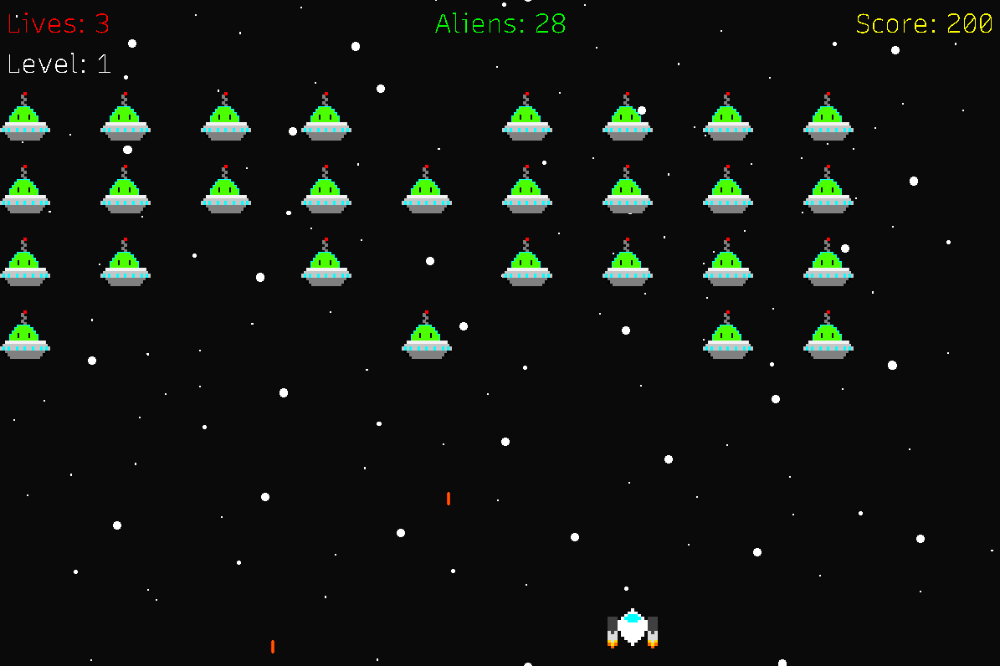

# Space Invaders
A simple [Space Invaders](https://en.wikipedia.org/wiki/Space_Invaders) clone made with Rust and SDL2.

## Controls  
 * **W/A** or **Left/Right** - Move left and right.  
 * **Space** - Shoot.  
 * **Escape** - Quit.  
 * **Left mouse click** - Select buttons.

## Attribution  
All sprites made with [Paint.NET](https://www.getpaint.net/).  
All sounds made with [as3sfxr](https://www.superflashbros.net/as3sfxr/).  
Font is [Recursive](https://fonts.google.com/specimen/Recursive) on [Google Fonts](https://fonts.google.com/).  
  
All music by [Kevin Macleod](https://incompetech.filmmusic.io/).

Werq by Kevin MacLeod  
Link: https://incompetech.filmmusic.io/song/4616-werq  
Licence: http://creativecommons.org/licenses/by/4.0/  
  
Chill Wave by Kevin MacLeod  
Link: https://incompetech.filmmusic.io/song/3498-chill-wave  
Licence: http://creativecommons.org/licenses/by/4.0/  